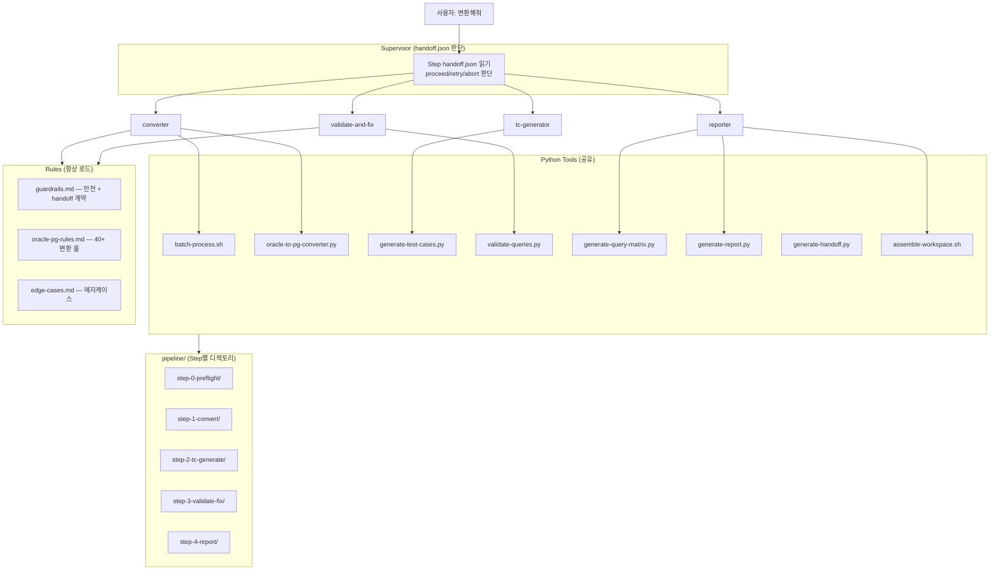
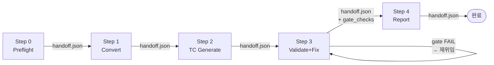
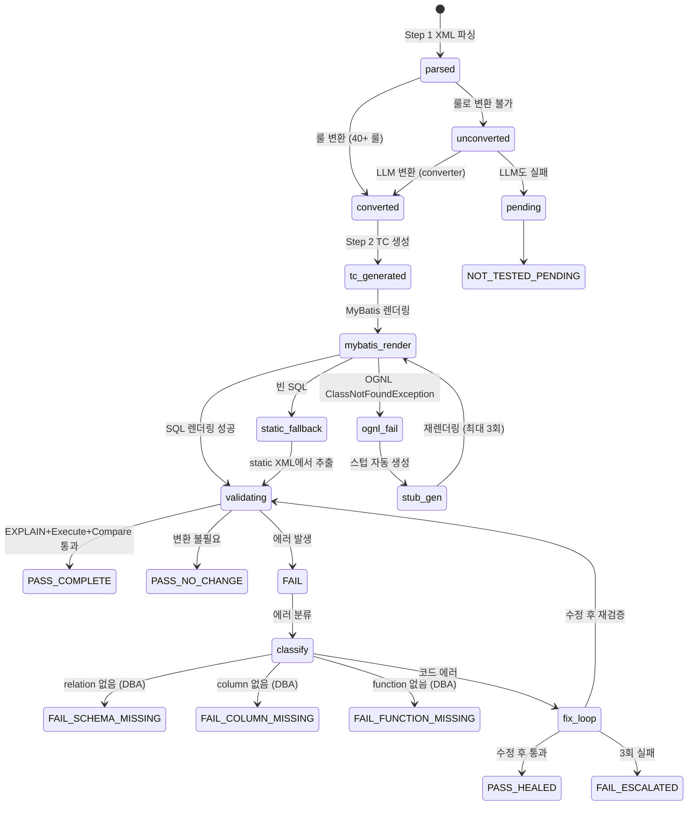

# OMA Architecture Guide

> Oracle → PostgreSQL MyBatis/iBatis 마이그레이션 에이전트 시스템 아키텍처.

---

## 1. System Overview



### 설계 원칙

| 원칙 | 설명 |
|------|------|
| **슈퍼바이저 = handoff 판단** | handoff.json만 읽고 proceed/retry/abort. 직접 도구 실행 안 함 |
| **Step별 디렉토리 분리** | 각 Step은 자기 output/ + handoff.json만 쓴다. 교차 쓰기는 Step 3→1 tracking만 |
| **EXPLAIN ≠ 완료** | Execute + Compare까지 필수. Compare mismatch도 FAIL |
| **모든 쿼리 TC 기반 검증** | 0건==0건도 PASS. 스킵 없음 |
| **DBA 에러 즉시 분리** | relation/column/function_missing → 수정 루프 진입 안 함 |
| **UTC timestamp** | 로그는 UTC Unix int. 보고서 JS에서 로컬 시간 표시 |
| **스킬 기반 실행** | 24개 스킬 (6 파이프라인 + 18 도메인). 에이전트 skills: 필드로 자동 inject |
| **모델**: opus[1m] | 슈퍼바이저 + converter + validate-and-fix. tc-generator/reporter는 sonnet |
| **iBatis 2.x 호환** | parse-xml, validate-queries, generate-test-cases에서 #param# + 동적 태그 지원 |

---

## 2. Pipeline + handoff.json 계약



| Step | 실행 주체 | 도구 | 산출물 | handoff 핵심 |
|------|----------|------|--------|-------------|
| **0** | 슈퍼바이저 | generate-sample-data.py | samples/, env-check.json | xml_file_count, env_checks |
| **1** | **converter** | batch-process.sh, converter.py | output/xml/, query-tracking.json | queries_total, complexity_dist |
| **2** | **tc-generator** | generate-test-cases.py | merged-tc.json | queries_with_tc, tc_source_dist |
| **3** | **validate-and-fix** | validate-queries.py | validated.json, compare.json | **gate_checks** (fix_loop + compare) |
| **4** | **reporter** | generate-query-matrix.py, generate-report.py | csv, json, html | validation (fields complete) |

### Step 3 → 4 GATE (★)

슈퍼바이저가 Step 3 handoff.json의 `gate_checks`를 읽고 판단:
- `fix_loop_executed.status == "fail"` → 재위임 ("수정 루프 0회 쿼리 있음")
- `compare_coverage.status == "fail"` → 재위임 ("Compare 미실행 N건")
- `fix_attempted == 0` AND 비-DBA FAIL → 재위임 ("수정 0건 불허")

---

## 3. 데이터 흐름

### 단계별 입출력 매핑

```
Step 0:
  READ:  pipeline/shared/input/*.xml
  WRITE: pipeline/step-0-preflight/output/samples/{TABLE}.json
         pipeline/step-0-preflight/handoff.json

Step 1:
  READ:  pipeline/shared/input/*.xml
         pipeline/step-0-preflight/output/samples/
  WRITE: pipeline/step-1-convert/output/xml/{file}.xml
         pipeline/step-1-convert/output/results/{file}/v1/query-tracking.json
         pipeline/step-1-convert/handoff.json

Step 2:
  READ:  pipeline/step-1-convert/output/results/*/v1/parsed.json
         pipeline/step-0-preflight/output/samples/
  WRITE: pipeline/step-2-tc-generate/output/merged-tc.json
         pipeline/step-2-tc-generate/handoff.json

Step 3:
  READ:  pipeline/step-1-convert/output/xml/{file}.xml
         pipeline/step-2-tc-generate/output/merged-tc.json
         pipeline/shared/input/*.xml (Compare용)
  WRITE: pipeline/step-3-validate-fix/output/validation/
         pipeline/step-3-validate-fix/output/extracted_pg/
         pipeline/step-1-convert/output/results/{file}/v1/query-tracking.json  ← cross-write
         pipeline/step-3-validate-fix/handoff.json (gate_checks)

Step 4:
  READ:  ALL query-tracking.json + validated.json + compare.json + extracted
  WRITE: pipeline/step-4-report/output/query-matrix.{csv,json}
         pipeline/step-4-report/output/migration-report.html
         pipeline/step-4-report/handoff.json
```

### query-matrix.json 필드 → 소스 매핑

| 필드 | 소스 Step | 파일 |
|------|----------|------|
| query_id, original_file | Step 1 | query-tracking.json |
| xml_before | Step 4 | input/*.xml에서 ET.tostring 추출 |
| xml_after | Step 4 | output/*.xml에서 ET.tostring 추출 |
| sql_before | Step 1 | extracted_oracle/ → query-tracking.json (fallback) |
| sql_after | Step 3 | extracted_pg/ → query-tracking.json (fallback) |
| conversion_method, conversion_history | Step 1 | query-tracking.json |
| test_cases | Step 2 | per-file/test-cases.json |
| attempts | Step 3 | query-tracking.json (Step 3이 갱신) |
| explain_status | Step 3 | validated.json → query-tracking.json |
| compare_status | Step 3 | compare_validated.json |
| final_state | Step 4 | generate-query-matrix.py가 계산 |
| complexity | Step 1 | complexity-scores.json |

---

## 4. Query Lifecycle (15-State)



### 15개 최종 상태

| 상태 | 조건 | 분류 |
|------|------|------|
| PASS_COMPLETE | conv + explain pass + compare pass | 성공 |
| PASS_HEALED | attempt > 0 + explain pass + compare pass | 성공 |
| PASS_NO_CHANGE | no_change + explain pass + compare pass | 성공 |
| FAIL_SCHEMA_MISSING | relation does not exist | DBA |
| FAIL_COLUMN_MISSING | column does not exist | DBA |
| FAIL_FUNCTION_MISSING | function does not exist | DBA |
| FAIL_ESCALATED | attempt ≥ 3 + fail | 코드 |
| FAIL_SYNTAX | explain fail + SYNTAX_ERROR | 코드 |
| FAIL_COMPARE_DIFF | compare fail | 코드 |
| FAIL_TC_TYPE_MISMATCH | TYPE_MISMATCH | TC |
| FAIL_TC_OPERATOR | TYPE_OPERATOR | TC |
| NOT_TESTED_DML_SKIP | DML + explain pass + compare not_tested | 미테스트 |
| NOT_TESTED_NO_RENDER | mybatis=no | 미테스트 |
| NOT_TESTED_NO_DB | explain/compare not_tested | 미테스트 |
| NOT_TESTED_PENDING | conv=pending | 미테스트 |

---

## 5. 디렉토리 구조

```
/tmp/oma-claude-code/
  CLAUDE.md                            # 슈퍼바이저 전용 (handoff 판단만)
  .claude/
    agents/                            # 4개 에이전트
      converter.md                     # Step 1
      tc-generator.md                  # Step 2
      validate-and-fix.md              # Step 3 + gate_checks
      reporter.md                      # Step 4 + assemble
    rules/                             # 공유 규칙 (항상 로드)
    skills/                            # 스킬 (20+)
    commands/                          # CLI 명령
    settings.json                      # hooks + permissions

  tools/                               # 공유 Python/Bash 도구
    generate-handoff.py                # ★ handoff.json 생성 유틸
    assemble-workspace.sh              # ★ pipeline → workspace 심링크 조립

  schemas/
    handoff.schema.json                # ★ handoff 스키마

  pipeline/                            # ★ Step별 디렉토리
    supervisor-state.json              # 슈퍼바이저 상태 (compaction 복구)
    shared/input/                      # → workspace/input 심링크
    step-0-preflight/output/ + handoff.json
    step-1-convert/output/ + handoff.json
    step-2-tc-generate/output/ + handoff.json
    step-3-validate-fix/output/ + handoff.json
    step-4-report/output/ + handoff.json

  workspace/                           # 하위 호환 (심링크 뷰)
```

---

## 6. 보고서

| 탭 | 내용 |
|----|------|
| **Overview** | 6카드 + Step Progress |
| **Explorer** | 파일→쿼리 트리 + MyBatis XML diff + 렌더링 SQL diff + Attempt History |
| **DBA** | 누락 오브젝트 그룹핑 + 0건 3분류 (양쪽0/Oracle만0/PG만0) |
| **Log** | activity-log.jsonl 타임라인 |

### 산출물

| 파일 | 위치 |
|------|------|
| migration-report.html | `pipeline/step-4-report/output/` |
| query-matrix.csv | `pipeline/step-4-report/output/` |
| query-matrix.json | `pipeline/step-4-report/output/` |

### query-matrix.json 쿼리 예제

```json
{
  "query_id": "selectUser",
  "original_file": "UserMapper.xml",
  "xml_before": "<select id=\"selectUser\">SELECT NVL(NAME,'N/A') FROM TB_USER<where><if test=\"id!=null\">AND ID=#{id}</if></where></select>",
  "xml_after": "<select id=\"selectUser\">SELECT COALESCE(NAME,'N/A') FROM TB_USER<where><if test=\"id!=null\">AND ID=#{id}</if></where></select>",
  "sql_before": "SELECT NVL(NAME,'N/A') FROM TB_USER WHERE ID='USR001'",
  "sql_after": "SELECT COALESCE(NAME,'N/A') FROM TB_USER WHERE ID='USR001'",
  "final_state": "PASS_COMPLETE",
  "final_state_detail": "변환+비교 통과",
  "conversion_method": "rule",
  "conversion_history": [
    {"pattern": "NVL", "approach": "COALESCE 치환", "confidence": "high"}
  ],
  "test_cases": [
    {"name": "sample_row_1", "params": {"id": "USR001"}, "source": "SAMPLE_DATA"}
  ],
  "attempts": [],
  "explain_status": "pass",
  "missing_object": null,
  "compare_status": "pass",
  "compare_detail": [{"oracle_rows": 3, "pg_rows": 3, "match": true}],
  "complexity": "L1"
}
```

### DBA 실패 쿼리 예제

```json
{
  "query_id": "selectAddr",
  "final_state": "FAIL_SCHEMA_MISSING",
  "explain_status": "fail",
  "missing_object": {"type": "table", "name": "taddr", "action": "CREATE TABLE taddr"},
  "compare_status": "not_tested"
}
```

### 상위 레벨 DBA 집계

```json
{
  "dba_objects": [
    {"type": "table", "name": "taddr", "action": "CREATE TABLE taddr",
     "affected_queries": [{"query_id": "selectAddr", "file": "AddrMapper.xml"}]}
  ],
  "dba_zero_rows": [{"query_id": "selectOld", "file": "OldMapper.xml"}],
  "compare_fail_types": {"oracle_error": 55, "row_mismatch": 4, "pg_error": 4}
}
```
