# OMA Kiro Architecture Guide

> Oracle to PostgreSQL MyBatis/iBatis 마이그레이션 에이전트 시스템의 전체 아키텍처, Phase별 플로우, 의사결정 트리를 설명합니다.

---

## 1. System Overview

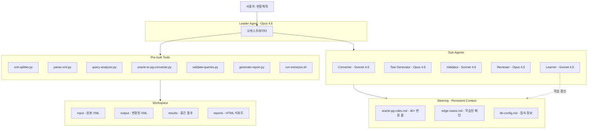

### 핵심 설계 원칙

| 원칙 | 설명 |
|------|------|
| **도구 우선** | Leader는 스크립트를 작성하지 않는다. `tools/`에 있는 도구만 실행한다 |
| **에이전트 분리** | Leader는 SQL을 직접 변환하지 않는다. 변환은 Converter, 검증은 Validator에 위임한다 |
| **리프 우선** | 의존성 그래프에서 리프 쿼리부터 변환한다. 하위가 실패하면 상위를 시도하지 않는다 |
| **버전 추적** | 모든 변환은 `v1 → v2 → v3`으로 버전 관리된다. 롤백 가능하다 |
| **학습 루프** | 실패 → 수정 → 성공 패턴이 steering에 축적된다. 다음 실행 시 자동 적용된다 |

---

## 2. Phase Pipeline

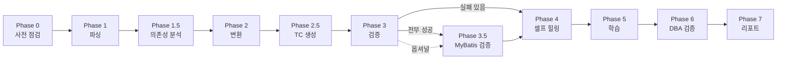

### Phase 요약

| Phase | 이름 | 실행 주체 | 도구/에이전트 | 산출물 |
|-------|------|----------|-------------|--------|
| **0** | 사전 점검 | Leader 직접 | shell | Pre-flight 결과 요약 |
| **1** | 파싱 | Leader 직접 | `xml-splitter.py` → `parse-xml.py` | `parsed.json`, `_metadata.json` |
| **1.5** | 의존성 분석 | Leader 직접 | `query-analyzer.py` | `dependency-graph.json`, `complexity-scores.json`, `conversion-order.json` |
| **2** | 변환 | Leader + **Converter** | `oracle-to-pg-converter.py` + Converter agent | `output/*.xml`, `conversion-report.json` |
| **2.5** | TC 생성 | **Test Generator** | Oracle Dictionary 조회 | `test-cases.json` |
| **3** | 검증 | Leader + **Validator** | `validate-queries.py` | `validated.json`, `execute_validated.json` |
| **3.5** | MyBatis 검증 | Leader 직접 | `run-extractor.sh` | `*-extracted.json` |
| **4** | 셀프 힐링 | **Reviewer** → **Converter** → **Validator** | 최대 3회 루프 | `review.json`, `v2/`, `v3/` |
| **5** | 학습 | **Learner** | steering 파일 갱신 + git | `edge-cases.md` 갱신, PR 생성 |
| **6** | DBA/Expert 검증 | Leader 직접 | DBA review checklist | `review-result.json` |
| **7** | 리포트 | Leader 직접 | `generate-report.py` | `migration-report.html` |

---

## 3. Phase 0: Pre-flight Check

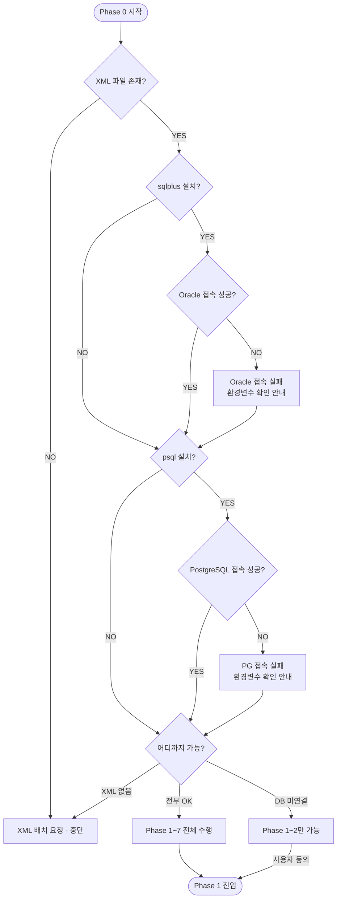

### Pre-flight 체크리스트

| 항목 | 체크 명령 | 필수 | 영향 |
|------|----------|------|------|
| XML 파일 | `ls workspace/input/*.xml` | **필수** | 없으면 전체 중단 |
| sqlplus | `which sqlplus` | 선택 | 없으면 Phase 2.5 스킵 |
| psql | `which psql` | 선택 | 없으면 Phase 3 스킵 |
| Oracle 접속 | `sqlplus ... "SELECT 1 FROM DUAL"` | 선택 | 실패 시 TC 생성 불가 |
| PostgreSQL 접속 | `psql -c "SELECT 1"` | 선택 | 실패 시 검증 불가 |

---

## 4. Phase 1 → 1.5: 파싱 & 분석

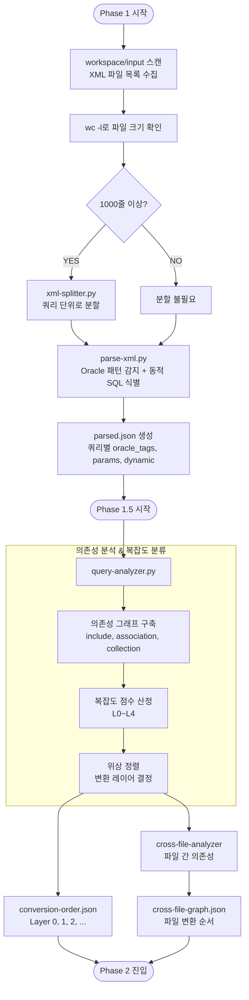

### 복잡도 분류 기준 - L0~L4

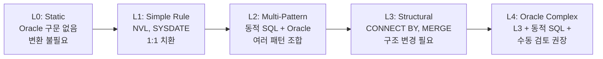

| Level | 점수 범위 | Oracle 패턴 예시 | 동적 SQL | 변환 전략 |
|-------|----------|-----------------|----------|----------|
| **L0** | 0 | 없음 | 없음 | 변환 불필요 |
| **L1** | 1~5 | NVL, SYSDATE, TO_DATE, ROWNUM, FROM DUAL | 단순 if | **룰 기반** 자동 치환 |
| **L2** | 6~15 | L1 + DECODE 중첩 + LISTAGG + 서브쿼리 | choose, foreach | **룰 우선**, 일부 LLM |
| **L3** | 16~30 | CONNECT BY, MERGE INTO, PIVOT | 복잡 동적 SQL | **LLM 위주** + transform-plan |
| **L4** | 31+ | L3 + 크로스 파일 + PL/SQL | 모든 조합 | **LLM + 수동 검토** 권장 |

### 점수 산정 요소

| 요소 | 점수 |
|------|------|
| NVL, DECODE, TO_DATE 등 단순 함수 | +1 each |
| ROWNUM pagination | +3 |
| CONNECT BY / START WITH | +5 |
| MERGE INTO | +5 |
| PIVOT / UNPIVOT | +4 |
| 동적 SQL if | +1 each |
| 동적 SQL foreach | +2 |
| 동적 SQL choose 중첩 | +3 |
| include 참조 | +1 each |
| selectKey | +2 |
| 크로스 파일 의존 | +3 |

---

## 5. Phase 2: 레이어별 변환

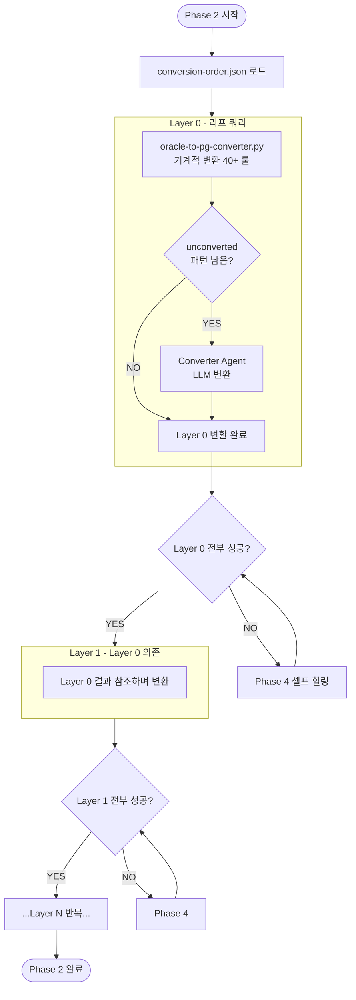

### 변환 전략 의사결정

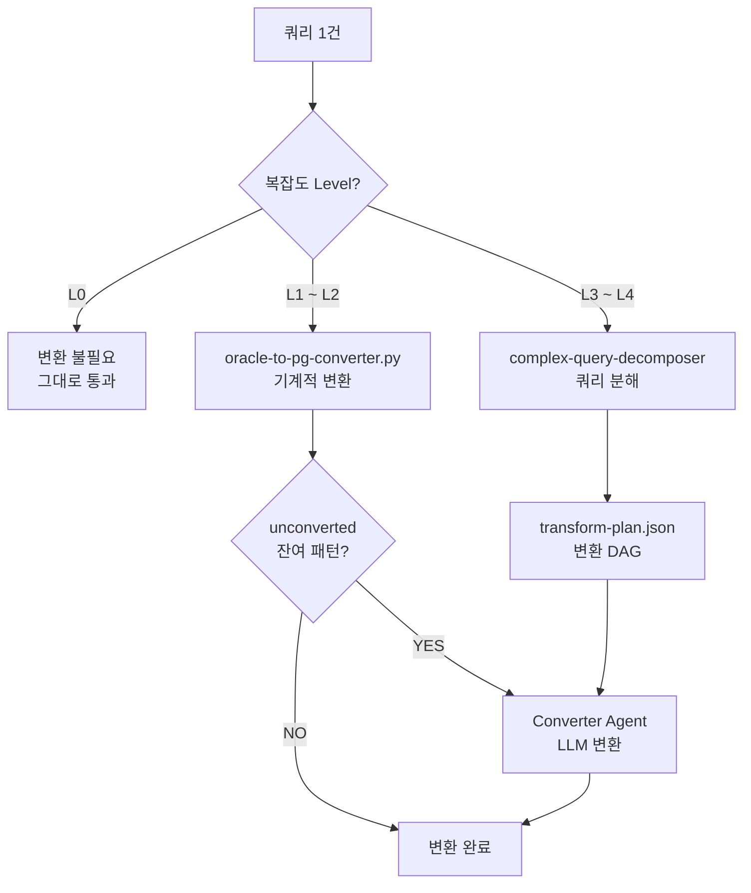

### 기계적 변환 룰 - 주요 40+

| 카테고리 | Oracle | PostgreSQL | 비고 |
|---------|--------|-----------|------|
| **함수** | `NVL(a, b)` | `COALESCE(a, b)` | 중첩 5단계 처리 |
| | `NVL2(a, b, c)` | `CASE WHEN a IS NOT NULL THEN b ELSE c END` | |
| | `DECODE(a,b,c,...)` | `CASE a WHEN b THEN c ... END` | 마지막 홀수=ELSE |
| **날짜** | `SYSDATE` | `CURRENT_TIMESTAMP` | |
| | `SYSDATE - 30` | `CURRENT_TIMESTAMP - INTERVAL '30 days'` | timestamp arithmetic |
| | `TRUNC(date)` | `DATE_TRUNC('day', date)::DATE` | 복잡 표현식 대응 |
| | `ADD_MONTHS(d, n)` | `d + n * INTERVAL '1 month'` | |
| **집계** | `LISTAGG(col, sep) WITHIN GROUP (...)` | `STRING_AGG(col, sep ORDER BY ...)` | |
| | `WM_CONCAT(col)` | `STRING_AGG(col::text, ',')` | |
| **시퀀스** | `seq.NEXTVAL` | `nextval('seq')` | |
| **페이지네이션** | `ROWNUM <= N` | `LIMIT N` | 3-level 패턴 대응 |
| | `FETCH FIRST N ROWS ONLY` | `LIMIT N` | 12c+ |
| **기타** | `FROM DUAL` | _(제거)_ | |
| | `MINUS` | `EXCEPT` | |
| | `/*+ HINT */` | `-- hint: ...` | 주석 변환 |

---

## 6. Phase 2.5 → 3: 테스트 & 검증

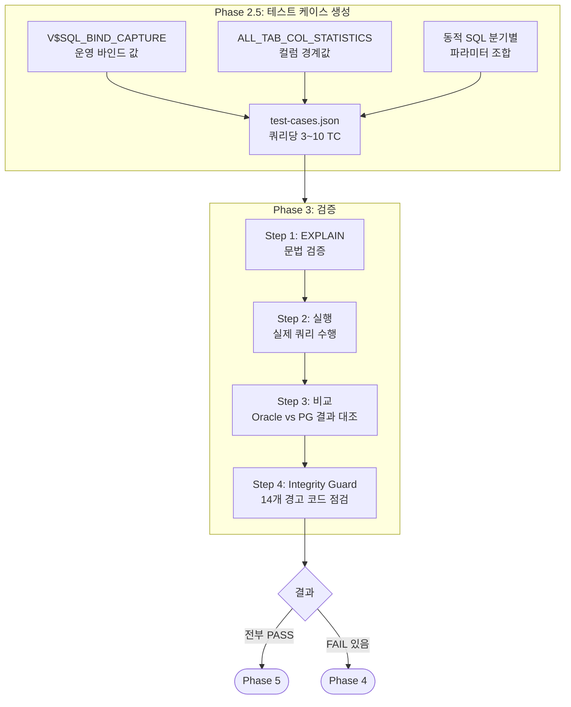

### 검증 4단계 상세

| 단계 | 도구 | 목적 | 판정 기준 |
|------|------|------|----------|
| **EXPLAIN** | `validate-queries.py --local` | PG SQL 문법 검증 | QUERY PLAN 반환 = PASS |
| **비교** | `validate-queries.py --compare` | **Oracle vs PG 양쪽 실행 + 결과 비교** | SELECT: row/값 일치, DML: affected rows 일치 |
| **실행** | `validate-queries.py --execute` | PG만 실행 (Oracle 불가 시 폴백) | 에러 없이 row count 반환 = PASS |
| **Integrity Guard** | `--compare` 내장 | 결과 신뢰성 검증 | 14개 경고 코드 |

### Result Integrity Guard 경고 코드

| 코드 | 심각도 | 의미 |
|------|--------|------|
| `WARN_ZERO_ALL_CASES` | **Critical** | 모든 TC에서 양쪽 0행 반환 |
| `WARN_MOSTLY_ZERO` | High | 80%+ TC에서 0행 반환 |
| `WARN_ZERO_BOTH` | High | SELECT에서 양쪽 0행 (테스트 데이터 부재 의심) |
| `WARN_ZERO_BOTH_DML` | Low | DML에서 양쪽 0건 (정상 — 데이터 없음) |
| `WARN_SAME_COUNT_DIFF_ROWS` | High | 행 수 동일하나 내용 다름 |
| `WARN_NULL_NON_NULLABLE` | Medium | NOT NULL 컬럼에 NULL 반환 |
| `WARN_WHITESPACE_DIFF` | Low | 공백 차이만 존재 |

---

## 7. Phase 4: 셀프 힐링

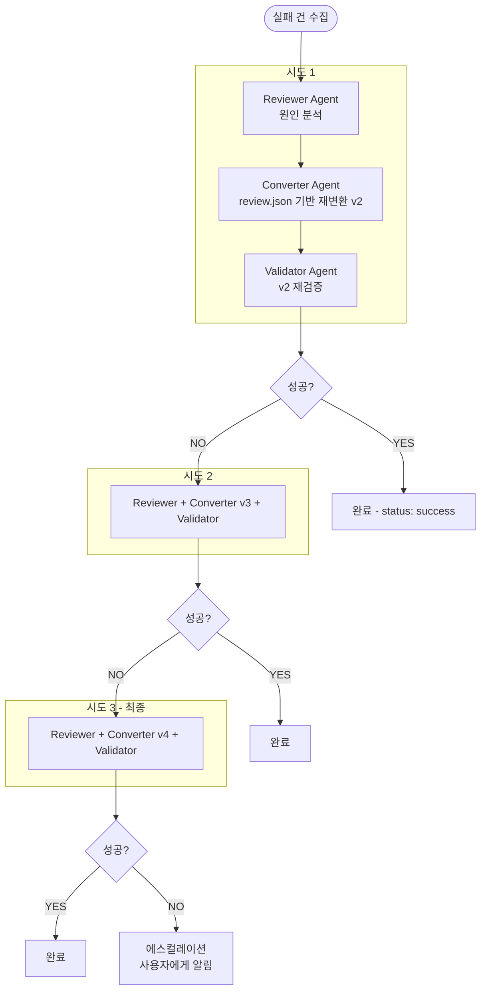

### 상태 전이

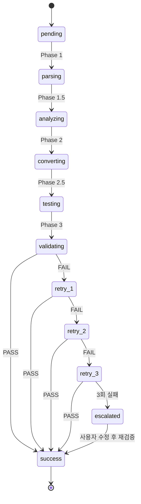

---

## 8. Phase 5 → 7: 학습 & DBA 검증 & 리포트

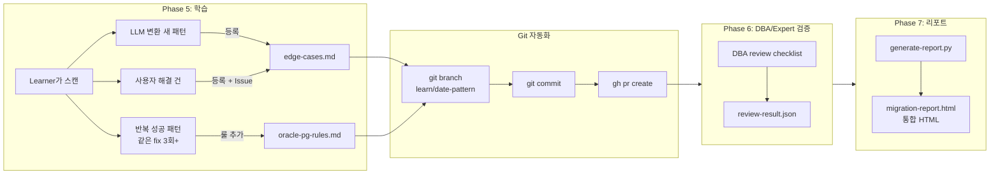

---

## 9. Phase 3.5: MyBatis 엔진 검증 - 옵셔널

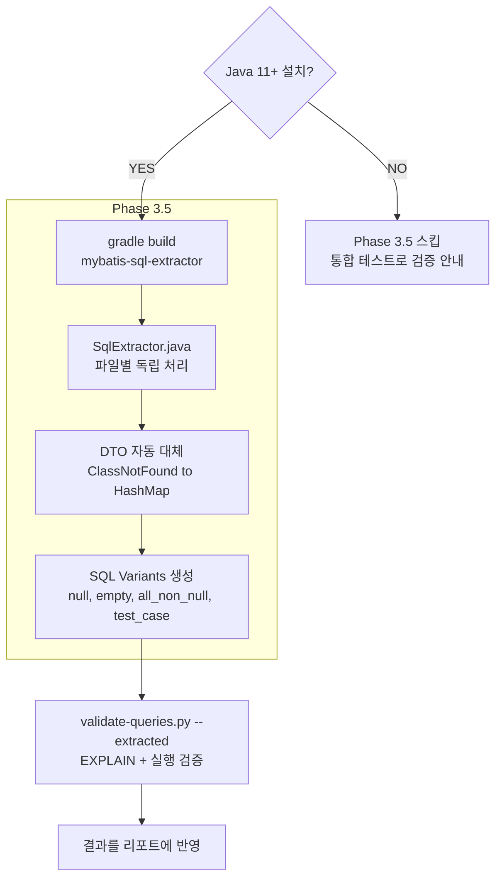

### Phase 3.5가 해결하는 문제

| 문제 | Phase 3만으로는 | Phase 3.5에서는 |
|------|----------------|-------------|
| `<if test="name != null">` | 정적 파싱으로 SQL 추정 | MyBatis OGNL 엔진이 정확히 평가 |
| `<foreach collection="list">` | 전개 불가, 더미 값 사용 | 실제 컬렉션으로 SQL 생성 |
| `<choose>/<when>/<otherwise>` | 모든 분기를 알 수 없음 | 파라미터 조합별 variant 추출 |
| `<include refid="...">` | 텍스트 치환으로 추정 | MyBatis가 정확히 resolve |

---

## 10. 에이전트 간 통신

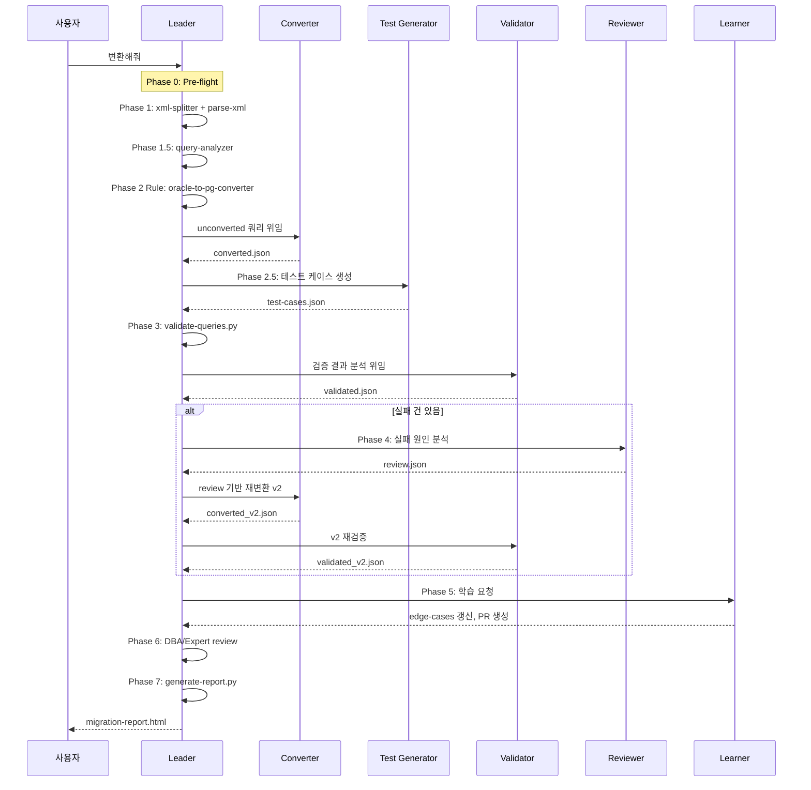

### 파일 기반 통신 규약

| 생성 | 소비 | 파일 | 위치 |
|------|------|------|------|
| Leader | Converter, Analyzer | `parsed.json` | `results/file/v1/` |
| Leader | Converter | `conversion-order.json` | `results/file/v1/` |
| Leader, Converter, Validator | All | `query-tracking.json` | `results/file/v1/` |
| Converter | Validator, Reviewer | `converted.json` | `results/file/v1/` |
| Test Generator | Validator | `test-cases.json` | `results/file/v1/` |
| Validator | Reviewer, Leader | `validated.json` | `results/_validation/` |
| Reviewer | Converter | `review.json` | `results/file/v1/` |

---

## 11. 전체 의사결정 트리

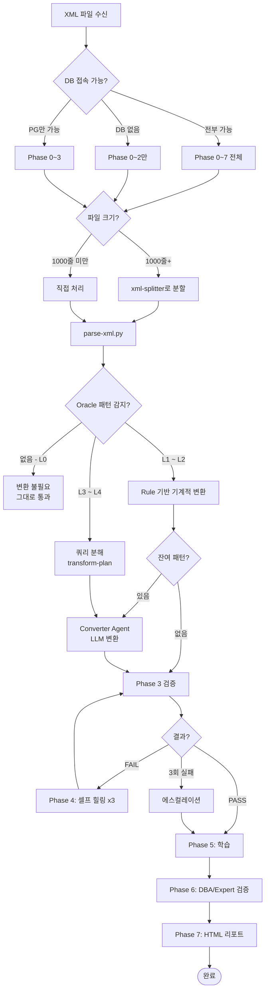

---

## 12. 디렉토리 구조 & 데이터 플로우

```
workspace/
├── input/                          # [불변] 원본 Oracle XML
│   ├── UserMapper.xml
│   └── OrderMapper.xml
│
├── output/                         # [Phase 2] 변환된 PostgreSQL XML
│   ├── UserMapper.xml
│   └── OrderMapper.xml
│
├── results/
│   ├── UserMapper/
│   │   ├── v1/
│   │   │   ├── chunks/             # Phase 1: 분할 결과
│   │   │   │   ├── _metadata.json
│   │   │   │   └── q_001_selectUser.xml
│   │   │   ├── parsed.json         # Phase 1: 파싱 결과
│   │   │   ├── query-tracking.json # Phase 1~7: 쿼리별 추적 (before/after, EXPLAIN, TC, timing)
│   │   │   ├── dependency-graph.json    # Phase 1.5
│   │   │   ├── complexity-scores.json   # Phase 1.5
│   │   │   ├── conversion-order.json    # Phase 1.5
│   │   │   ├── conversion-report.json   # Phase 2
│   │   │   └── test-cases.json          # Phase 2.5
│   │   └── v2/                     # Phase 4: 재시도 시 생성
│   │       └── ...
│   │
│   ├── _global/
│   │   └── cross-file-graph.json   # Phase 1.5: 크로스 파일 의존성
│   │
│   ├── _validation/                # Phase 3
│   │   ├── explain_test.sql
│   │   ├── execute_test.sql
│   │   ├── test_manifest.json
│   │   ├── validated.json          # EXPLAIN 결과
│   │   ├── execute_validated.json  # 실행 결과
│   │   └── batches/                # SSM 원격 실행용
│   │
│   └── _extracted/                 # Phase 3.5
│       ├── UserMapper-extracted.json
│       └── OrderMapper-extracted.json
│
├── reports/
│   └── migration-report.html       # Phase 7: 통합 HTML 리포트
│
├── logs/
│   └── activity-log.jsonl          # 전체 감사 로그
│
└── progress.json                   # 실시간 진행 상태
```

---

## 13. 에이전트 구성 상세

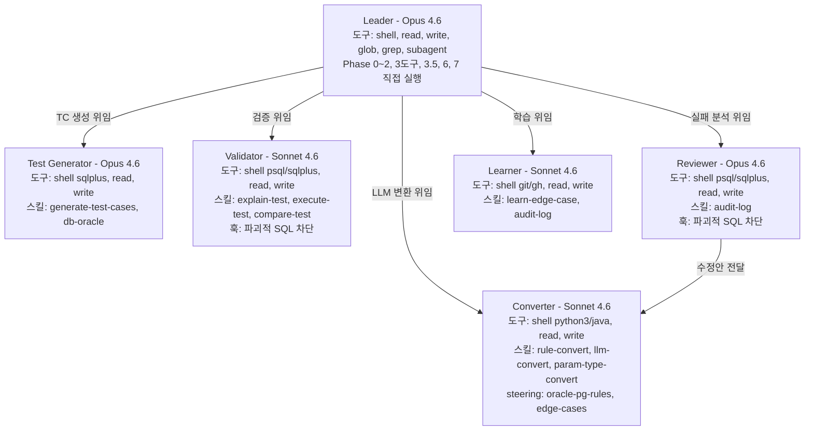

---

## 14. SSM 원격 실행 패턴

VPC 내부 Aurora/RDS에 직접 접속이 불가한 경우, AWS SSM을 경유하여 검증합니다.

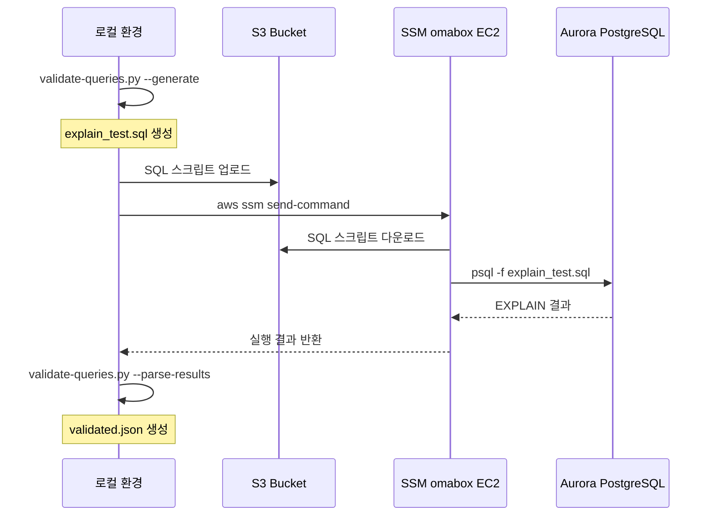

---

## 15. 실행 예시

### 전체 자동 실행

```
사용자: 변환해줘

Leader:
======================================
>>> Phase 0: 사전 점검
======================================
XML 파일: 11개 감지
sqlplus: NOT FOUND
psql: OK
PostgreSQL 접속: OK
-> Phase 1~3, 6 진행 가능 (TC 생성은 스킵)

>>> Phase 1: 파싱 완료 (11파일, 172쿼리)
>>> Phase 1.5: 의존성 분석 완료 (L0:45, L1:67, L2:38, L3:15, L4:7)
>>> Phase 2: 변환 완료 (Rule:158, LLM:14)
>>> Phase 3: EXPLAIN 검증 81/87 PASS, 6 FAIL
>>> Phase 4: 셀프 힐링 6건 -> 5건 성공, 1건 에스컬레이션
>>> Phase 5: edge-cases.md에 3건 추가, PR #2 생성
>>> Phase 6: DBA/Expert 검증 완료
>>> Phase 7: migration-report.html 생성

workspace/reports/migration-report.html 에서 결과를 확인하세요.
```

### 특정 파일만

```
사용자: UserMapper.xml만 변환해줘
Leader: UserMapper.xml 1건만 Phase 0~7 실행
```

### 에스컬레이션 후 재개

```
사용자: selectComplexReport 쿼리 수정했어. 다시 검증해줘
Leader: v3 생성 -> Validator 검증 -> 성공 -> Learner 학습
```
