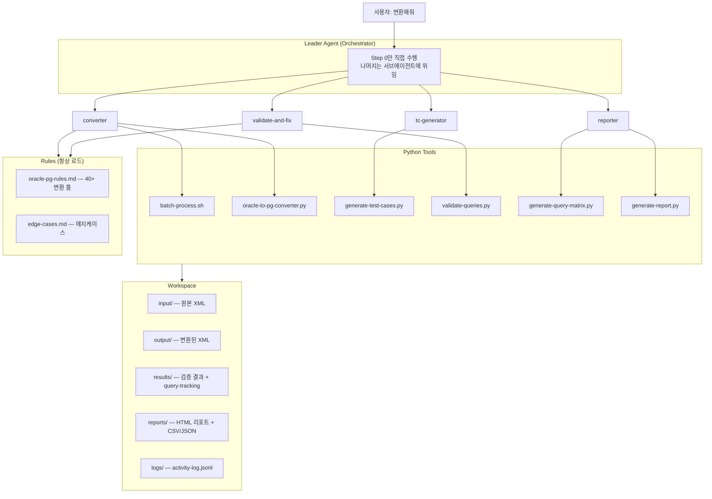
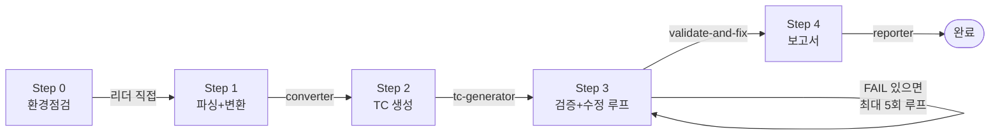
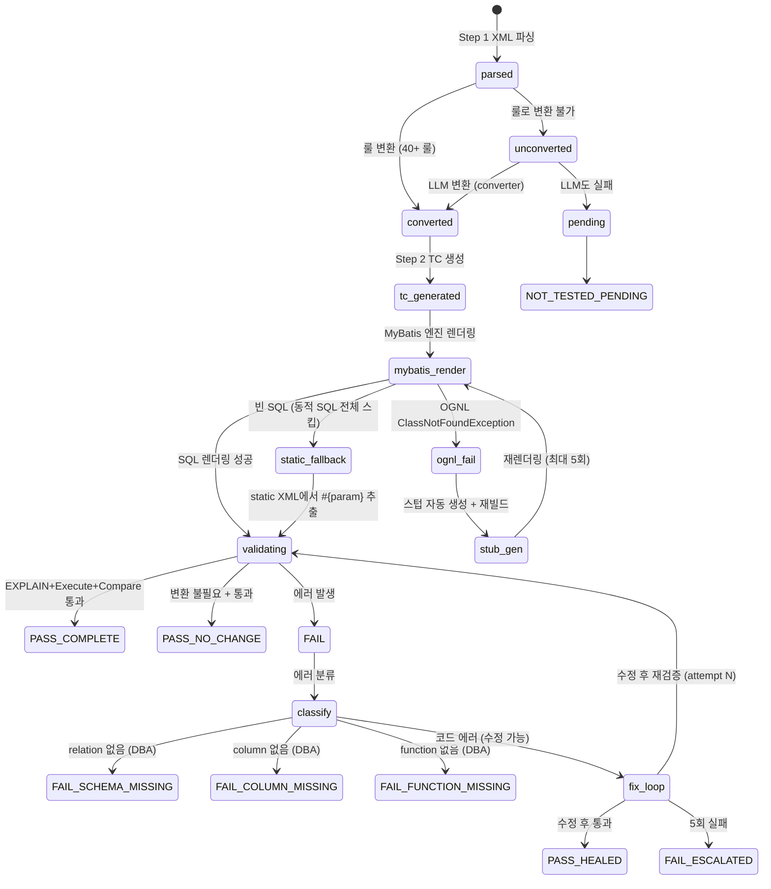
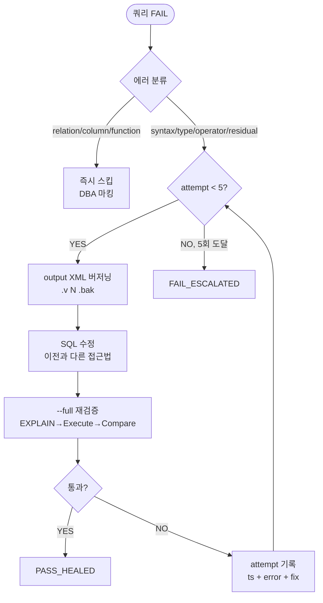

# OMA Architecture Guide

> Oracle → PostgreSQL MyBatis/iBatis 마이그레이션 에이전트 시스템 아키텍처.

---

## 1. System Overview



### 설계 원칙

| 원칙 | 설명 |
|------|------|
| **리더 = 오케스트레이터** | 리더는 직접 도구를 실행하지 않는다. 서브에이전트에 위임하고 결과만 확인 |
| **모든 쿼리 = TC 기반 검증** | 하나도 스킵하지 않는다. 0건==0건도 유효한 PASS |
| **EXPLAIN ≠ 완료** | EXPLAIN 통과만으로 끝내지 않는다. Execute + Compare까지 필수 |
| **스키마 에러 즉시 분리** | relation/column/function_missing은 루프 돌리지 않고 DBA에 보고 |
| **UTC timestamp** | 로그는 UTC unix timestamp. 보고서에서 로컬 시간으로 표시 |

---

## 2. Pipeline



| Step | 실행 주체 | 도구 | 산출물 |
|------|----------|------|--------|
| **0** | 리더 직접 | shell, generate-sample-data.py | 환경 확인, _samples/*.json |
| **1** | **converter** | batch-process.sh, oracle-to-pg-converter.py | output/*.xml, query-tracking.json |
| **2** | **tc-generator** | generate-test-cases.py | test-cases.json, merged-tc.json |
| **3** | **validate-and-fix** | validate-queries.py, run-extractor.sh | validated.json, compare_validated.json |
| **4** | **reporter** | generate-query-matrix.py, generate-report.py | query-matrix.csv/json, migration-report.html |

---

## 3. Query Lifecycle

하나의 쿼리가 파이프라인을 통과하는 전체 과정:



---

## 4. 14개 최종 상태

모든 쿼리는 파이프라인 종료 시 아래 14개 상태 중 **정확히 하나**로 분류된다.

### 성공 (PASS)
| 상태 | 조건 | 설명 |
|------|------|------|
| PASS_COMPLETE | conv + explain pass + compare pass | 한번에 통과 |
| PASS_HEALED | attempt > 0 + explain pass + compare pass | 수정 후 통과 |
| PASS_NO_CHANGE | no_change + explain pass + compare pass | Oracle 구문 없어 변환 불필요 |

### 실패 — DBA (스킵, 루프 안 돌림)
| 상태 | 조건 | 설명 |
|------|------|------|
| FAIL_SCHEMA_MISSING | error: relation does not exist | PG 테이블 없음 |
| FAIL_COLUMN_MISSING | error: column does not exist | PG 컬럼 없음 |
| FAIL_FUNCTION_MISSING | error: function does not exist | PG 함수 없음 |

### 실패 — 코드 (수정 루프 대상)
| 상태 | 조건 | 설명 |
|------|------|------|
| FAIL_ESCALATED | attempt ≥ 5 + (explain fail OR compare fail) | 5회 시도 후 미해결 |
| FAIL_SYNTAX | explain fail + SYNTAX_ERROR/AMBIGUOUS/OTHER | SQL 문법 에러 |
| FAIL_COMPARE_DIFF | compare fail + attempt < 5 | Oracle↔PG 결과 불일치 |
| FAIL_TC_TYPE_MISMATCH | TYPE_MISMATCH 또는 VALUE_TOO_LONG | 바인드값 타입 불일치 |
| FAIL_TC_OPERATOR | TYPE_OPERATOR | 연산자 타입 불일치 |

### 미테스트
| 상태 | 조건 | 설명 |
|------|------|------|
| NOT_TESTED_NO_RENDER | converted + not_tested + mybatis=no | MyBatis 렌더링 실패 (static fallback 후에도 검증 불가) |
| NOT_TESTED_NO_DB | converted + not_tested (또는 explain pass + compare not_tested) | DB 미접속 |
| NOT_TESTED_PENDING | conv = pending | 변환 미완료 |

### 분류 우선순위

```
1. PASS (attempt>0 → HEALED, no_change → NO_CHANGE, 나머지 → COMPLETE)
2. DBA (MISSING_TABLE > MISSING_COLUMN > MISSING_FUNCTION)
3. ESCALATED (attempt ≥ 5)
4. COMPARE_DIFF (compare=fail)
5. SYNTAX (explain=fail + SYNTAX/AMBIGUOUS/OTHER)
6. TC 문제 (TYPE_MISMATCH > TYPE_OPERATOR > VALUE_TOO_LONG)
7. NOT_TESTED (NO_RENDER > NO_DB > PENDING)
```

**DBA 상태는 ESCALATED보다 항상 우선.** 5회 시도해도 테이블이 없으면 FAIL_SCHEMA_MISSING이지 FAIL_ESCALATED가 아니다.

---

## 5. 수정 루프 (Step 3)



### attempt 기록 구조

```json
{
  "attempts": [
    {
      "attempt": 1,
      "ts": 1713100860,
      "error_category": "SYNTAX_ERROR",
      "error_detail": "syntax error at or near \"NVL\"",
      "fix_applied": "NVL→COALESCE 변환 누락 수정",
      "result": "fail"
    },
    {
      "attempt": 2,
      "ts": 1713100920,
      "error_category": null,
      "error_detail": null,
      "fix_applied": "CASE 문법 수정",
      "result": "pass"
    }
  ]
}
```

---

## 6. 로깅

### 자동 로깅 (hook)

`.claude/settings.json`의 hook이 모든 도구 호출과 서브에이전트 완료를 자동 기록:

```
PostToolUse (Bash|Edit|Write) → activity-log.jsonl
SubagentStop                  → activity-log.jsonl
```

### 도구 내부 로깅

각 도구가 `tracking_utils.log_activity()`로 Step 시작/종료를 기록:

```python
log_activity('STEP_END', agent='converter', step='step_1', detail='...')
```

### 타임스탬프

- 저장: **UTC Unix timestamp** (int) — `{"ts": 1713100860}`
- 표시: 보고서 JS에서 `new Date(ts * 1000).toLocaleString()` → 사용자 로컬 시간

---

## 7. 보고서

### 구성

| 탭 | 내용 |
|----|------|
| **Overview** | 6카드 (파일, 쿼리, PASS, FAIL코드, FAIL DBA, 미테스트) + Step Progress 바 |
| **Explorer** | 파일→쿼리 트리 + 쿼리 상세 (Oracle/PG SQL 비교, 14-state 배지, TC 결과, Attempt History) |
| **Log** | activity-log.jsonl 타임라인 (Error/Decision/Warning 필터) |

### 산출물

| 파일 | 형식 | 내용 |
|------|------|------|
| `migration-report.html` | HTML | 브라우저에서 열기. 서버 불필요 |
| `query-matrix.csv` | CSV | 쿼리별 flat 컬럼 (변환/검증/비교) |
| `query-matrix.json` | JSON | 쿼리별 상세 (sql_before/after, attempts, test_cases, final_state) |

### JSON 산출물 필드 (쿼리당)

```
query_id → original_file → sql_before → sql_after → final_state → final_state_detail
→ test_cases[{name, params, source}]
→ attempts[{attempt, ts, error_category, error_detail, fix_applied, result}]
→ explain_status → compare_status → conversion_method → complexity
```

---

## 8. 에이전트 아키텍처

```
Leader (오케스트레이터)
  ├── Step 0: 환경점검 (직접 수행)
  ├── Step 1: converter × N (병렬, 3파일/30쿼리 단위)
  ├── Step 2: tc-generator × 1
  ├── Step 3: validate-and-fix × N (병렬, 파일 단위)
  └── Step 4: reporter × 1
```

| 에이전트 | 모델 | 역할 | 병렬 |
|---------|------|------|------|
| converter | Sonnet | 파싱 + 룰변환 + LLM변환 | ✅ 3파일 단위 |
| tc-generator | Sonnet | TC 생성 (고객>샘플>VO>딕셔너리>추론) | - |
| validate-and-fix | Sonnet | 검증 + 에러분류 + 수정 루프 (최대 5회) | ✅ 파일 단위 |
| reporter | Sonnet | 파이프라인 점검 + 상태 검증 + 보고서 | - |

### 리더가 하는 것 / 안 하는 것

| ✅ 하는 것 | ❌ 안 하는 것 |
|-----------|-------------|
| Step 0 환경점검 | 도구 직접 실행 |
| 서브에이전트 spawn | SQL 직접 수정 |
| 반환 결과 확인 | 보고서 직접 생성 |
| 다음 Step 진행 판단 | TC 직접 생성 |
| 사용자에게 결과 보고 | 검증 직접 수행 |

---

## 9. TC 생성 (Step 2)

### 소스 우선순위

```
0. 고객 바인드값 (custom-binds.json) ← 최우선
1. 샘플 데이터 (_samples/*.json) ← Oracle 테이블 실데이터
2. Java VO (--java-src) ← 필드 타입 기반
3. V$SQL_BIND_CAPTURE ← 운영 캡처값
4. ALL_TAB_COL_STATISTICS ← MIN/MAX 경계값
5. ALL_CONSTRAINTS (FK) ← 참조 테이블 샘플
6. 이름/타입 추론 ← fallback
```

### TC 종류 (쿼리당 최대 6종)

| TC | 소스 | DML 제외 |
|----|------|---------|
| custom_1 | 고객 제공 | - |
| sample_row_1~3 | 샘플 데이터 | - |
| default | 추론 | - |
| null_test | NULL 시맨틱 | ✅ |
| empty_string | 빈 문자열 | ✅ |
| boundary | 컬럼 통계 MAX | ✅ |

---

## 10. 디렉토리 구조

```
workspace/
  input/                          # 원본 Oracle MyBatis XML (불변)
    *.xml
    custom-binds.json             # 고객 제공 바인드값 (선택)
  output/                         # 변환된 PostgreSQL XML
    *.xml
    *.xml.v1.bak, .v2.bak         # 수정 전 버전 백업
  results/
    {file}/v1/
      parsed.json                 # 파싱 결과
      query-tracking.json         # 쿼리별 상태 + attempts
      test-cases.json             # TC
      converted.json              # 변환 결과
    _samples/{TABLE}.json         # Oracle 테이블 샘플 (10행)
    _test-cases/merged-tc.json    # MyBatis extractor용 TC
    _validation/
      validated.json              # EXPLAIN 결과
      compare_validated.json      # Compare 결과
      explain_test.sql            # 생성된 EXPLAIN 스크립트
      execute_test.sql            # 생성된 Execute 스크립트
      oracle_compare.sql          # 생성된 Oracle 비교 스크립트
    _extracted_pg/                # MyBatis 렌더링된 PG SQL
  reports/
    migration-report.html         # HTML 리포트
    query-matrix.csv              # 쿼리 매트릭스 (flat)
    query-matrix.json             # 쿼리 매트릭스 (상세, attempts 포함)
  logs/
    activity-log.jsonl            # 전체 활동 로그 (hook + 도구)
  progress.json                   # 파이프라인 상태
```
